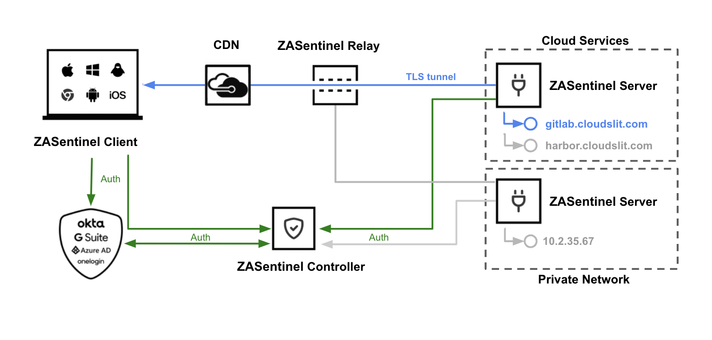
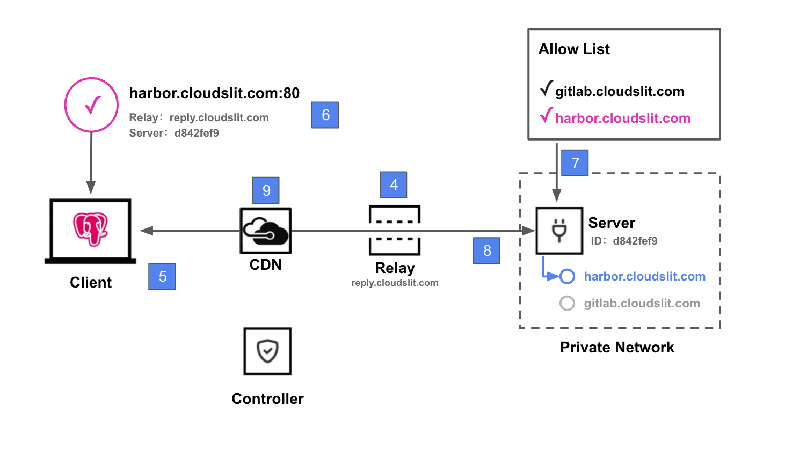

# ZASentinel white paper

## Thank you for your interest in ZASentinel

ZASentinel helps organizations improve information security by providing a better and simpler way to protect access to private network resources and applications.

The information contained in this document is intended to provide customers and potential customers with transparency and confidence about the security situation, practices and processes of ZASentinel. Although this document represents the security of ZASentinel when it was last updated, ensuring information security is a process of continuous improvement, and we will not stop the evaluation and support.

This document is divided into two main parts. The first part describes the security architecture of ZASentinel from the perspective of products, and the second part describes the general information security practices of ZASentinel.

## Product safety

### 1.1 Product Architecture and Design

#### Overview of Methods

ZASentinel was originally designed to provide a safe solution for modern "working anywhere" employees. Modern labor force is increasingly dispersed:

- More and more users work at home and in remote locations such as public places;
- User devices are scattered among desktop and mobile devices, devices for job posting and personal devices;
- The application is being migrated from inside to the cloud or provided by a third-party SaaS provider;
- Networks are increasingly cloud-based or managed by third parties.

Therefore, the traditional fixed boundary method based on IP address can't meet today's security or availability requirements. ZASentinel's answer is a method based on the concept of zero trust access, which we call identity first network.

#### Identity first network

The premise behind ZASentinel's identity first network model is to rethink the basic assumptions of the network to meet the needs of modern labor force. The dispersion and abstraction of users, devices, applications and networks (for example, through infrastructure such as Terraform, that is, code framework) means that different methods are needed.

Our identity-first approach starts with asking a simple question: Should network requests be allowed to leave the device? And if so, whose identity should it be attached to? Because there is no clearly authorized identity, the network connection is never allowed to enter your network, so there is no longer the question of who the network connection belongs to and why it is authorized.

This connection between network request initiation and identity makes it very easy to understand the activities inside the network. Gone are the days of whitelisting IP addresses,

Maintain complex subnet assignments and VLAN segments, or manually piece together network events across physical networks. With ZASentinel, you can provide users with the flexibility they need to work anywhere, while maintaining confidence that every network connection is authorized and audited according to the user's identity.

#### Zero Trust Access (ZTA)

ZASentinel's architecture is designed according to ZTA's main philosophy:

- Every request for private resources should be authenticated and authorized based on real-time context information, such as user identity, device status and other attributes such as time and location.
- Users should only have access to the minimum necessary resources (principle of least privilege).
- Events should be recorded in detail to support monitoring, detection, investigation and other analysis.

Generally speaking, these principles are embodied in our products in the following ways:

- No ZASentinel component can independently decide to allow traffic to flow to secure resources on remote networks. And user data flow authorization is always confirmed by running multiple checks by multiple components. In addition, the user data flow and the user authentication flow are handled by separate components and require separate authentication checks.
- We entrust user authentication to a third-party authentication provider, which creates a separation of concerns and provides an additional layer of security.
- We support extensive logging, provide enhanced visibility, and help administrators monitor, troubleshoot, and investigate the activities of the entire network and terminals, including unauthorized activities, as well as those of individuals who are authorized to access resources but may exceed their business authority.
- User data streams from the client to the server are encrypted end-to-end. Even though they can pass through relays (components residing in the infrastructure controlled by ZASentinel), ZASentinel cannot decrypt such data. (Encrypted transmission will never have intermediate termination/recovery on the relay. )
- Our client-relay-server, all components communicate with each other by upgrading to websocket protocol, which better supports the transfer of custom parameters and facilitates the verification of data security and legality.
- Our relay is mounted under the CDN network, which can effectively prevent DDOS attacks, and better optimize network lines to improve access speed. The network CDN supports Websocket protocol and seamlessly integrates with ZASentinel network.
- Our client application is designed to always run in the background.

From the customer's point of view, our product architecture provides additional security advantages in the following aspects:

- Hide the network -ZASentinel will not publicly expose the access point to your network to promote secure remote access to resources inside the network. This means that, if necessary, the customer network can remain invisible to the public Internet, and it will not be explored by potential attackers.
- Support granular access control at port level -Compared with VPN that provides access to the whole network, this helps to reduce the explosion radius of intrusion.
- Centralized access management for all private resources  -This helps IT team to audit and maintain access list to cope with personnel changes.
- Record all network activities centrally -Identity index log and analysis can provide insight into who is doing what in the whole enterprise network.
- Better availability for administrators -Solutions that are easier to configure and maintain are less prone to errors and more effective.
- Provide better usability for end users -This is an easy-to-deploy, always-on solution, which does not hinder users, promotes the adoption of VPN clients, and avoids common problems of VPN clients, where users shut down their internet connections because they interrupt or slow down.
- Provide a safe and fast network line -As a public basic service, the relay is mounted under the CDN network to optimize the network access line and effectively prevent DDOS attacks.

#### Architecture & Component Overview

This section provides a high-level overview of the main components that make up the ZASentinel architecture and how they interact. The architecture of ZASentinel is in our document, and we strongly recommend that you read this article in order to have a more comprehensive understanding of the security foundation of ZASentinel.

ZASentinel protects access to customers' remote network resources. ZASentinel consists of four main components, which together ensure that only authenticated users can access the resources they have access to. After ZASentinel is fully configured, the end result is that authorized users can connect to any resource without knowing the underlying network configuration or even which remote network the resource resides on. The four main components are:

- Controller-central coordination component of -ZASentinel. The controller is a multi-tenant component operated by ZASentinel. It performs a number of duties, including storing the client configuration information management console managed based on web to register and verify the server, issuing the signature authorization to the client that successfully sends the connection request, entrusting the user authentication to the identity provider, and distributing the signed access control list to the client and the server.
- Client-A software application installed on the end user's device. For users' requests for protected resources, the client acts as a combined authentication and authorization agent through ZASentinel. Routing and authorization decisions take place at the edge of the client.
- Server-A software component designed to be deployed on a device behind a remote network firewall. The server only starts the outbound connection with the controller and relay, and establishes communication with the client through these connections.
- Relay-geographically distributed components operated by ZASentinel. The relay serves as the registration point of the server and the connection point of the client wishing to establish a connection to the server. The relay is mounted under the CDN network to resist DDOS attacks.

Client and server components are located on the equipment and infrastructure controlled by customers, while controller and relay components are located in the infrastructure controlled by ZASentinel.

The following diagram illustrates how various components exchange information in a secure way, so as to connect from the client to a specific resource on a remote network:

1.The server registers itself with the geographically nearest relay.

The relay does not receive any information about the server except the randomly generated ID and its signature signed by the controller. Only when the signature of the server is signed by the same controller, the relay allows the server to register.

2.The client and the server respectively receive the traffic forwarding permission list.

Allow lists to be specific to each component. The client's allow list corresponds to the content that users are allowed to access, and the server's list covers the resources that administrators have configured. Two allow lists must be signed by the same controller.

3.The client is authenticated by a third-party identity provider, providing additional in-depth protection.

4.The client initiates a TLS connection with a single end-to-end certificate lock to the requested server.

The relay only promotes this connection, but can't "see" any such data flow.

5.The server verifies whether the client request is signed by the same controller.

6.The client verifies whether the server signature matches the signature provided by the controller.

7.The server verifies whether the target address is in its allowed list.

8.Once established, the traffic flows to the destination through the encrypted TLS tunnel. DNS lookup and routing are forwarded from the client and executed by the server on the target network.

9.The relay can be mounted under the CDN network
The relay is mounted on the CDN network, and the CDN supports websocket protocol, which better supports the transmission of Header parameters. In terms of security, the CDN can naturally resist DDOS attacks, and effectively optimize network lines and increase traffic communication speed.

### 1.2 Customer data

#### What customer data do we process?

The main types of customer data processed by ZASentinel are:

- User details (such as email addresses, names and group members, but not passwords, as ZASentinel entrusts authentication to a third-party identity provider);
- Infrastructure information (such as network details, resource details and access control list);
- Logs (such as crash and error reports for diagnosis and troubleshooting). The ZASentinel component also records events that allow customers to monitor user activities (for example, user login and token requests).

User network traffic destined for resources protected by ZASentinel can be transmitted through ZASentinel relay in encrypted form. This traffic carrying data is relayed on an instantaneous basis. The relay does not store traffic or any network identifiable information.

ZASentinel can also process customer data submitted by customers related to customer support requests. This may include configuration data, error logs, and other information that customers decide to provide to ZASentinel for reporting and diagnosing technical problems.

#### data separation

Customer data is logically isolated in ZASentinel's system according to customer tenant ID.

#### Data confidentiality

According to our contract with customers, ZASentinel regards customer data as confidential information of customers, and the ownership of customer data is reserved by customers.

### 1.3 Product performance and scalability

Service reliability is the core aspect of information security. This section describes service reliability related to performance and scalability. For information on service reliability in terms of availability, please see the following infrastructure & physical security.

We have designed our infrastructure and software to ensure that ZASentinel performs well, even when the usage of individual customers or our entire customer base increases. The main ways for us to achieve this goal include:

- Eliminate the backhaul/trombone problem-the traffic routed through ZASentinel takes a more direct route, instead of routing all traffic through a central gateway geographically far from the start and end points, thus reducing the delay of users and the bandwidth usage of organizations. ZASentinel clients automatically and intelligently connect to ZASentinel controllers and relays, which provide the best performance according to the physical location of users at that time and the resources they need to connect to.
- Support split tunnel-Any user traffic that the organization chooses not to route through ZASentinel will completely bypass ZASentinel and be handled by user equipment independently. This reduces unnecessary traffic sent through additional hops.
- Load balancing-Zasentinel handles multiple levels of load balancing. The controllers and relays of ZASentinel are distributed in different places and geographical areas. As part of infrastructure planning, our goal is to allocate them strategically to reduce delays and provide load balancing in areas where expected traffic loads are high. For example, in high-traffic areas, we can add additional controllers and relays, and balance the load among them. By using the same IaaS provider hosting controller and relay used by customers (for example, in Alibaba Cloud, Huawei Cloud and GCP), the delay is further reduced. On the client side, customers can install multiple servers in the same remote network, and ZASentinel will automatically handle the load balance between the servers to meet the access request of a specific network.
- Handling extensions for customers-The traditional network access security model requires organizations to deploy and maintain their own security infrastructure, such as VPN gateways. Expanding the scale will increase the management cost disproportionately and occupy the resources that can be used for other plans. ZASentinel alleviates IT departments' concerns about expansion.
- Distributed authorization processing-the authorization processing workload is distributed, such as at the ZASentinel client level, which helps to improve the overall performance, instead of being concentrated in one place.

## Information security plan

### 2.1 Overview

This section contains a summary of ZASentinel's information security plan. ZASentinel keeps a set of written information security plans, policies and procedures. These plans, policies and procedures are reviewed at least once a year and supplemented by regular risk reviews, which will be incorporated into the continuous development of our information security plan.

### 2.2 Management and organizational security

#### Governance & Responsibility

The chief technology officer of ZASentinel is mainly responsible for ZASentinel's information security plan. ZASentinel also has an interdisciplinary security team, which is responsible for implementing, reviewing and maintaining its information security plan. Its members include senior managers.

However, as a safety project, ZASentinel believes that safety is a universal problem, so it is the common responsibility of our whole organization. For example, all our engineers are required to regard safety as a basic part of their work, and they will not simply delegate all responsibilities to other colleagues who are more concerned about safety.

### 2.3 Application Security

#### Data Protection & Access Control

##### Access control

We provide users with access to the system according to the user role and the principle of least privilege.

Use ZASentinel to protect access to private network resources in production and other environments. Authentication is performed by our identity provider's single sign-on system, and multi-factor authentication is enabled. With ZASentinel, we can also finely control user access rights at the resource level (instead of the network level) according to the principle of minimum rights, and apply different security policies according to the authentication of users, devices and the context requesting access.

Enterprise applications use SSO and MFA for authentication as much as possible, and enforce minimum password complexity requirements.

We also automate the deployment process of the production environment, which means that users have no right to make changes to the production environment manually or directly. Developers cannot directly access the database containing customer data. Developers usually don't have or need to access the production environment server through SSH.

##### Access monitoring

We use ZASentinel and other log systems to monitor access to various systems and all aspects of ZASentinel infrastructure.

##### CDN network

CDN network can effectively resist DDOS attacks and optimize network access lines.

The network CDN supports Websocket protocol and seamlessly integrates with ZASentinel network.

##### Data encryption

Encrypt customer data in transit and at rest using industry standard encryption protocol.

During transmission, client application communication is protected by TLS/SSL (HTTPS) connection.

In static state, customer data is stored in the database managed by the platform, which is encrypted by AES-256 or better standard and uses symmetric key. The data key itself is encrypted using the master key stored in the secure keystore, and is changed regularly.

We do not use any custom or proprietary encryption framework or implementation. Please note that ZASentinel does not store any customer passwords.

#### Software Development Methodology & Testing

##### Software development

All written software codes have to be reviewed by the second person's code. In addition, ZASentinel also performs internal and third-party security tests, as described below.

Developers often have no access to production systems or data. Customer data is not used for testing.

We usually inform customers of major updates of downloadable software components. Minor updates, such as adjustments to the user interface, will be released regularly without explicit notice. When the latest stable version of ZASentinel software is available, we recommend that customers upgrade to this version.

##### Internal security test

ZASentinel uses various tools to statically analyze the code and report problems-both our proprietary code and vulnerabilities in third-party libraries. According to our vulnerability management policy, patch the detected vulnerabilities in time.

##### Third-party security testing

ZASentinel will cooperate with third-party organizations to regularly conduct security tests on its applications. Testing activities extend from penetration testing to application security assurance and product analysis, including:

- Analyze ZASentinel component by component in a "white box" environment
- Reverse engineering, runtime and static analysis of each component to ensure that the engineering design conforms to the best practice safety guidelines;
- Perform automated stress testing, manual vulnerability discovery, and runtime and source code review
- Conduct threat modeling.

##### Penetration test request

We allow our customers to conduct penetration tests on our system in some cases. Customers must obtain prior approval from our security team and inform us of the time and scope of penetration testing in advance, and may need to sign an agreement covering such testing activities.

### 2.4 Infrastructure and Physical Security

#### Equipment security

All end users' laptops and desktops need to install anti-virus/anti-malware software and enable full disk encryption.

#### Infrastructure change management

Every change proposed to our production environment (including infrastructure changes) must be approved, and every such change and corresponding approval should be recorded. Our CI/CD pipeline supply infrastructure will be changed automatically after approval.

#### Confidential management

We use a commercial secret management system provided by a major supplier to store secrets, such as authentication tokens, passwords, API vouchers and certificates. Key rotation at regular intervals.

#### Server hardening

We mainly interact with the server by deploying Docker containers coordinated with Kubernetes.

#### Network segmentation

Our production network is divided into different areas according to the security level. Each environment has its own subnet, and only the network policy based on the predefined allow list allows internal communication.

#### Availability & Elasticity

When our services need to access mission-critical network resources, service availability is crucial. We ensure very high service availability by:

- Use a world-class infrastructure provider to host our core components.
- Using multiple geographically separated data centers-Zasentinel's infrastructure is hosted in multiple physically separated cloud platform data centers to achieve redundancy. This helps to balance the load and reduces the risk of natural disasters in the environment and other specific locations.
- Implement fault-tolerant, redundant infrastructure-Our services are provided by multiple data centers, which reflect each other's capabilities. If one data center has an availability problem, other data centers will automatically bear the load.
- Provide the ability to resist DDOS attacks-We have implemented certain measures to reduce the risk of DDOS attacks.
